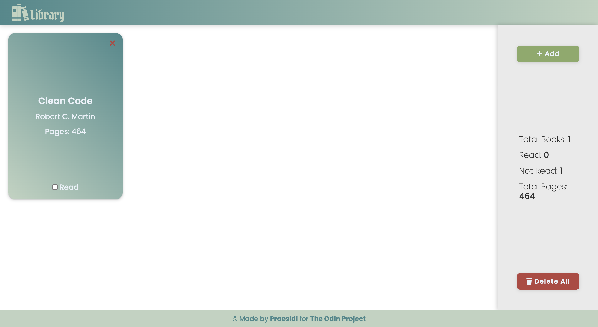
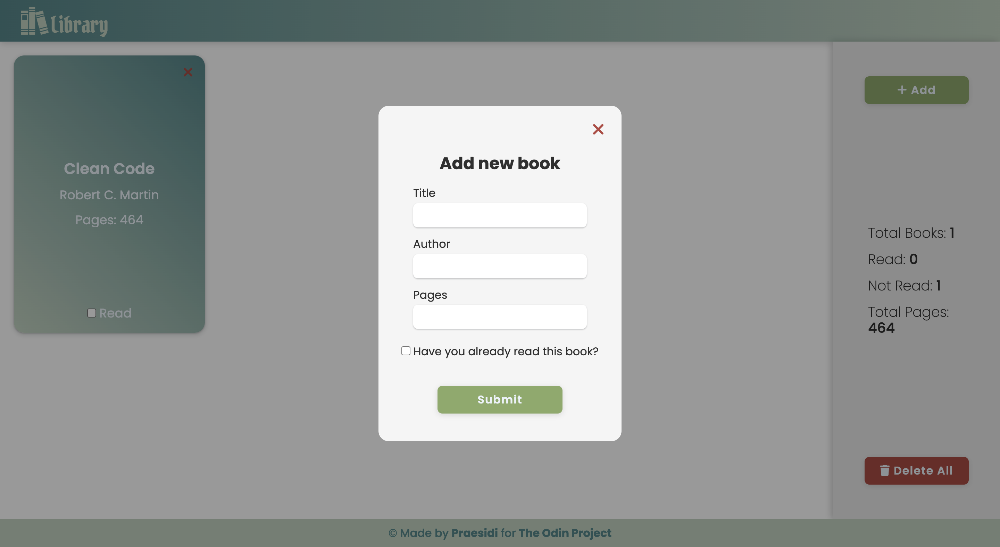

# Library

<h3 align="center"><a href="https://praesidi.github.io/library/">DEMO</a></h2>

## About the project

This project was made as a part of The Odin Project curriculum. The main goal was to create a web-application where users can save and delete books, change books' status, and track overall library statistics.
The project isn't mobile responsive, but I will fix it in the near future.

## Features

- User can delete any book
- User can mark books as read
- Overall stats on the sidebar

## Resources

- Icons: [fontawesome.com](fontawesome.com)
- Logo&Favicon: [flaticon.com](flaticon.com)

## Built with

- HTML
- CSS
- JS

## Future Updates

- Make the page mobile responsive
- Add local and cloud storage
- Make different backgrounds for read and not read books
